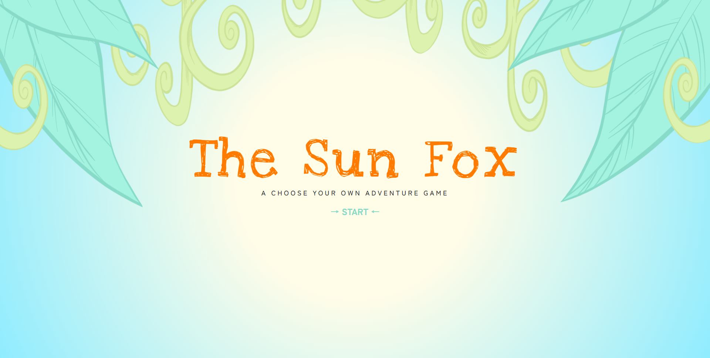
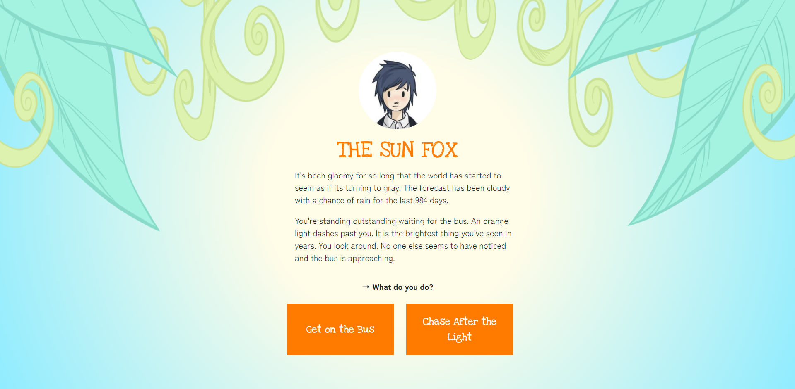
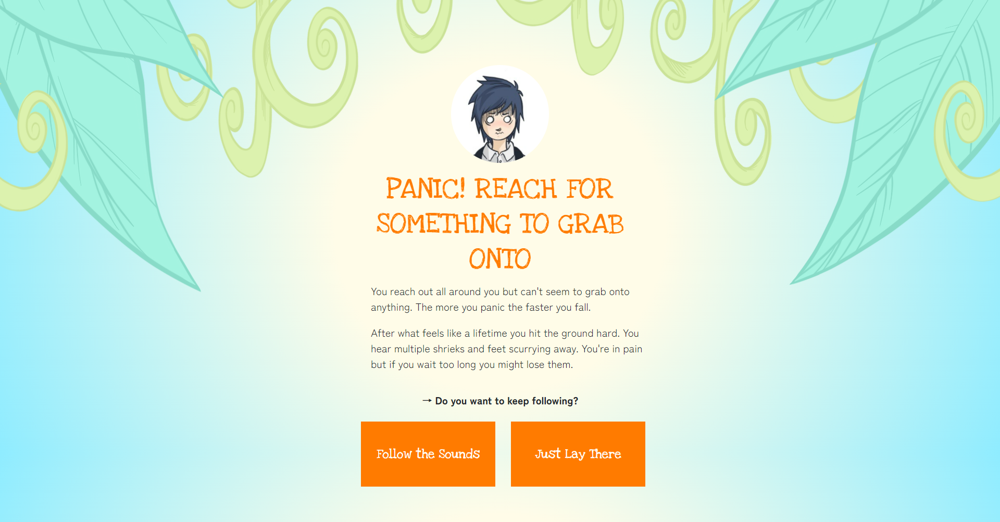

# Choose Your Own Adventure: The Sun Fox

## Project Summary
Constructed a JavaScript game that was modeled after the Create Your Own Adventures books. It functions through interactive onclick events that offer the player new options, images, and scenarios. 
It was programmed to deconstruct and pass several objects through a singular function to progress the game until the player quits or reaches the end. The first draft of this project just consisted of functions passing functions until the game ended. I rebuilt this project to make it object-oriented. Instead of functions passing through each other several objects pass through one function. I learned how to pass functions by deconstructing objects and how to set a function as an object property.

`View the active site & play the game:` [https://rachelnurmi91.github.io/TheSunFox/](https://rachelnurmi91.github.io/The-Sun-Fox/)

### Built with
- JavaScript
- HTML
- CSS

## Project Screenshots

> Screenshot of the title screen.

> Start of game screenshot.

> Screenshot a random scene from the game to show the changes in avatar, text and buttons.
